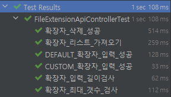
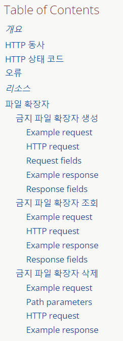
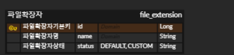

# 마드라스체크 사전 과제 REST API 문서
<br>

## Table of Contents
- [개요](#개요)
- [Skill](#Skill)
- [Installation](#Installation)
- [Running Tests](#running-tests)
- [API Reference](#api-reference)
- [프로젝트 진행 및 이슈 관리](#프로젝트-진행-및-이슈-관리)
- [ERD](#ERD)

<br>

## 개요
어떤 파일들은 첨부시 보안에 문제가 될 수 있다. 특히 exe, sh 등의 실행파일이 존재할 경우 서버에
올려서 실행이 될 수 있는 위험이 있어 파일 확장자 차단을 기획하게 됨.

`주요기능`
> 1. 운영자는 금지할 파일 확장자를 설정한다.
> 2. 파일 확장자는 기본 확장자 유저가 지정하는 확장자 두개로 나눠진다
> 3. 파일 확장자를 금지시킬 수 있고 다시 허용시킬 수 있다.

<br>

## Skill
<div align="center">
</a>
</a>
</a>
</a>
</div>
<div align="center">
</a>


</div>
<div align="center">
</a>
</div>

## Installation

```bash
./gradlew bootjar
./gradlew bootrun
```

## Running Tests
```bash
  ./gradlew test
```

> <br>
> 

## API Reference
> [](https://madrascheck.u-jinlee.dev/docs/index.html)<br>
> 

## 프로젝트 진행 및 이슈 관리

> [](https://github.com/users/U-jinLee/projects/3/views/1)<br>
> 


## ERD
> 
> - 파일확장자의 상태는 DEFAULT, CUSTOM 두 가지로 나눠진다

